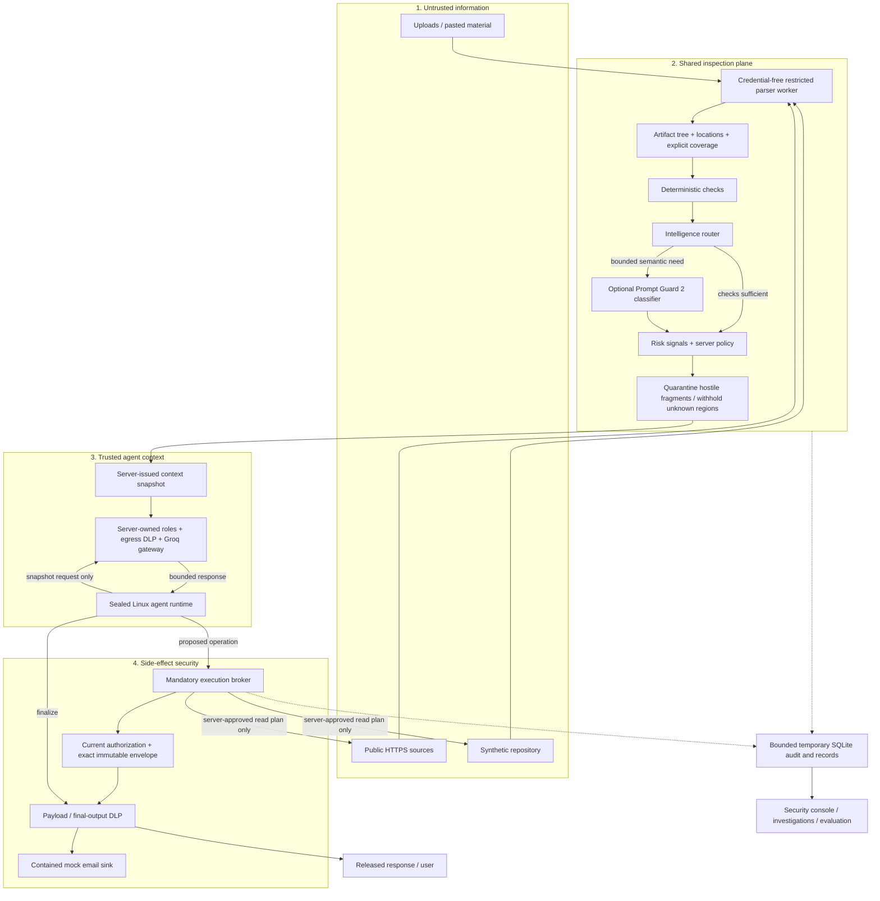
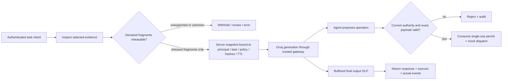

# Implemented architecture

The console is React/TypeScript on Vercel. A single FastAPI service on Render hosts the versioned API, shared inspection plane, credentialed model gateway, server-owned agent profiles and execution broker. Existing Linux Landlock/seccomp isolation is retained. No additional microservices were added.

The snapshot is not an authorization credential: the broker validates ownership, release hashes, current policy and expiry. Partial original files are never passed to the agent. Only inspected text fragments are imported as separately released UTF-8 evidence. Unsupported children remain withheld. Sanitized data remains untrusted.

Attack Lab A removes application firewall defenses in a synthetic model comparison. B uses deterministic controls; C adds the measured routed classifier. All tool effects are contained. Model persuasion, legitimate-task completion, detection, simulated execution and leakage are reported separately.

History is temporary SQLite on Render's free filesystem, not durable enterprise storage. Binary uploads are discarded after extraction. Persistent memory, arbitrary shell, live repository writes, autonomous red-team generation and general MCP access remain disabled.
