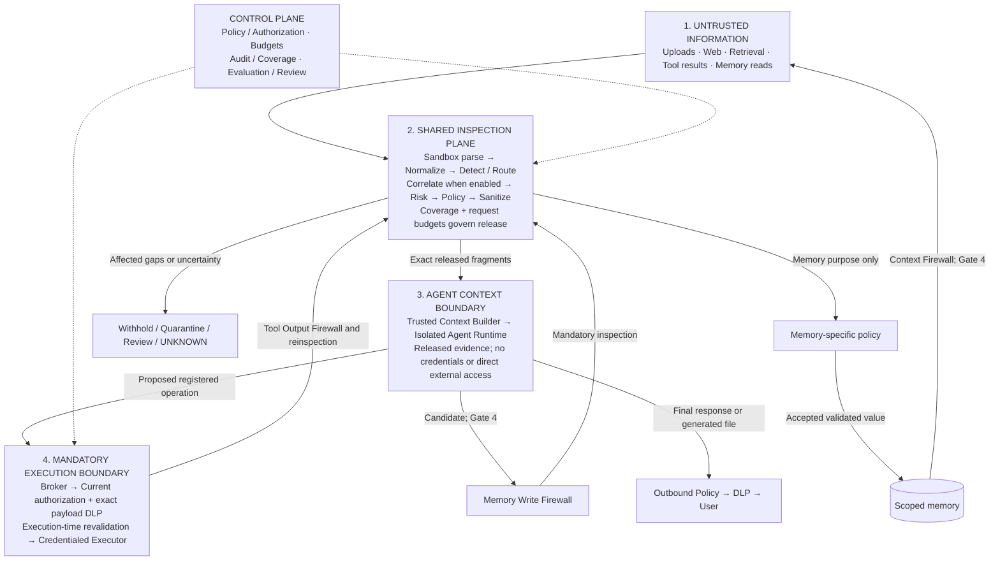
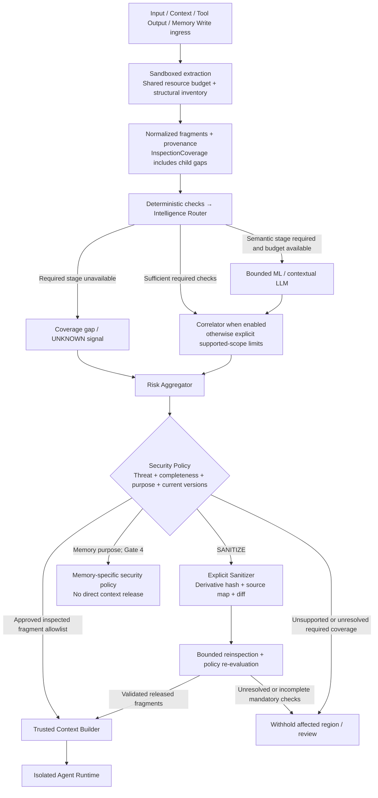
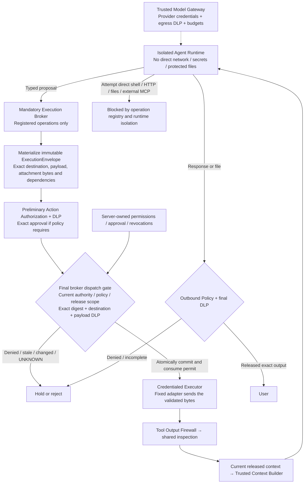
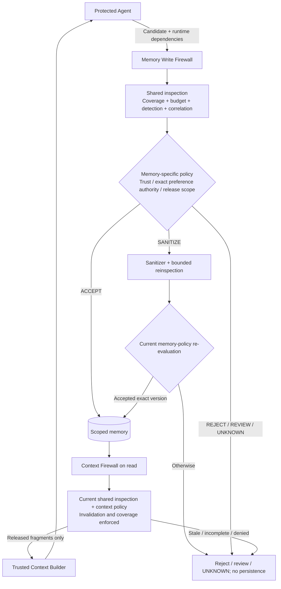

# Agent Trust Firewall — phased implementation plan (Revision 3)

Build middleware that inspects information entering an agent, independently authorizes its operations, and controls information leaving it. The product succeeds when the attacker objective fails **and** the authorized procurement task still completes.

**Revision 3 retains the approved target architecture and adds execution isolation, execution-time revalidation, enforceable inspection completeness, staged scope, stronger evaluation, and inspection budgets.** This document specifies target implementation work; actual prototype evidence is recorded separately in gate1-acceptance-report.json.

**Development window confirmed by the user: 1–2 weeks.** Assume 3–4 engineers. Replace the previous 15-day estimate with five acceptance gates after scope/design finalization. A narrow release is achievable before every target capability exists; disabled or unsupported features must be labelled accurately.

## Changes required by the technical review

### Final implementation amendments — approved Revision 3

**Implementation status (9 October 2026):** Gate 1's text vertical slice now passes the tested Linux deployment image: 44 tests pass and 2 historical macOS-only tests are skipped. Actual Linux file/credential/network/shell/connector probes are denied and the legitimate brokered task completes. The API and static Vercel interface are implemented; Groq generation is real. Each API startup repeats the isolation test, and Render's host still needs cloud acceptance. Native macOS execution remains disabled after the preserved synthetic-only environment-read failure. Gates 2–5, semantic security classification, other formats and persistent memory are not complete. See README.md and gate1-linux-acceptance-report.json for current evidence and limits.

**Real-model follow-up:** An opt-in trusted-process Groq adapter now supports synthetic real-model testing without starting the agent runtime. The eight-request, four-case comparison is recorded in groq-live-report.json; source is groq_ai.py. This validates a live provider connection and records model behavior plus broker containment. It does not close the isolation blocker, enable later gates, or measure a semantic security classifier's incremental benefit.

1. **Model Gateway authority:** agent requests contain only an opaque server-issued snapshot reference and a registered operation. The authenticated broker connection supplies principal/session/task identity. The gateway looks up the snapshot server-side, verifies ownership, task binding, expiry, hashes, current policy and exact release decisions, then asks TrustedContextBuilder to construct provider messages. Agent-supplied message arrays, roles, system prompts, trust labels, identity fields, and snapshot IDs cannot establish authority. Test forged roles/fields, cross-user/task snapshots, stale decisions, expired snapshots, and policy changes.
2. **Intent versus supplied material:** structured task submission distinguishes AUTHORIZED_TASK_INTENT, USER_SUPPLIED_UNTRUSTED_CONTENT, and EXTERNAL_RETRIEVED_EVIDENCE. These categories are assigned by authenticated application channels; authentication alone does not promote pasted/quoted/attached material into instructions. Ambiguous mixed text is withheld as task intent or conservatively moved into the evidence channel with a bounded analysis task. Test attack-bearing quotations submitted by a legitimate user and instruction-role spoofing inside them.
3. **Earlier semantic evaluation:** evaluate/select a purpose-trained injection classifier in Gate 2 using development validation and matched deterministic/full configurations. Record missed attacks recovered, introduced false positives, router decisions, latency, and cost. Gate 3 integrates the selected classifier only if measured benefit justifies it. Contextual LLM escalation remains optional in Gate 4; untouched family-separated evaluation remains required.
4. **Compromise containment:** Gate 1 includes a forced-compromise experiment: submit attacker-chosen model outputs/operations without relying on the scanner to detect them. Verify protected-file reads, unauthorized sensitive disclosure, trusted-instruction overwrite, persistent-memory writes, permit replay, and alternate network/MCP paths fail. Extend this suite whenever new capabilities are enabled. Disabled memory must reject writes rather than provide a provisional persistence path.

Gates 1, 2, 3, and 5 are critical delivery priorities; Gate 4 is optional differentiation. Reduce Gate 4 scope before reducing seven-category evaluation or legitimate-task evidence. Enable fewer thoroughly tested adapters when necessary and publish their actual coverage. Implementation starts with Gate 1; later capabilities remain disabled until their prerequisites and acceptance suites pass.

| Priority | Change | Implementation gate and evidence |
|---|---|---|
| P0 | Mandatory execution boundary | Gate 1: runtime isolation, complete operation registry, direct-network/file/connector bypass tests |
| P0 | Authorization checked at execution | Gate 1: immutable execution envelope, current permissions/policy, final destination and payload checks, mutation/revocation/replay tests |
| P0 | Inspection completeness enforced by policy | Contracts finalized before implementation; Gates 1–3: partial/unsupported coverage prevents whole-artifact release |
| P1 | Smaller initial scope | Gate 1 text-only slice; Gate 2 TXT/static HTML/PDF; Gate 3 additional adapters; Gate 4 advanced defenses |
| P1 | Stronger evidence | Evaluation starts in Gate 1; Gate 5 reports unseen families, category/surface outcomes, and matched baselines |
| P1 | Inspection cost and availability | Gate 1 budget accounting; Gates 2–4 token, compute, provider, request, and rescan limits with explicit failure behavior |

## Product boundaries and release scope

The target includes Input, Context, Action, Tool Output, and Data-Loss Firewalls. They use one shared inspection pipeline and server-managed policy. Separate components identify threats, assess risk, decide disposition, sanitize evidence, assemble context, and execute authorized operations.

The first vertical slice accepts UTF-8 text proposals, compares supplier facts using a fixed rubric, and supports one mock email operation plus brokered access to synthetic documents. It includes the Trusted Context Builder, deterministic action authorization, payload/final-output DLP, audited decisions, and inspection completeness. Persistent memory, arbitrary code execution, general-purpose shell tools, and unrestricted connectors remain disabled.

| Release level | Delivered scope | Claim permitted after evidence |
|---|---|---|
| Gate 1 slice | Text task, isolated agent runtime, mandatory broker, deterministic controls, synthetic tools/data | Demonstrated enforcement for the registered operations and tested deployment |
| Gate 2 core | TXT, static HTML, declared PDF channels; normalizer, provenance, policy, sanitizer, context builder | Declared inspected channels and measured detection; partial coverage shown |
| Gate 3 multiformat | DOCX, XLSX, common raster images, nested ZIPs containing supported artifacts | Per-adapter/channel coverage and seven-category detection where demonstrated |
| Gate 4 advanced | Bounded cross-source/session correlation, persistent memory protection, contextual semantic analysis, targeted reinspection | Only implemented and tested stateful scenarios |
| Gate 5 evidence | Reproducible report, restrained interface, protected/unprotected comparison, reliability demo | Measured results and limitations for the actual release |

Source code can be inspected as text after Gate 2; AST-aware repository analysis is deferred. Static HTML processing does not inspect content generated by scripts. Audio, video, legacy binary formats, arbitrary OLE execution, production RAG connectors, and broad repository/database ingestion are later expansion work.

The seven F3 target categories from the supplied problem statement are instruction override, role change, secret extraction, tool abuse, credential theft, encoded instructions, and indirect prompt injection. Context poisoning and multi-step jailbreaks receive selected Gate 4 scenarios; do not count these as comprehensive additional categories without evaluation.

F3 requires working **detection** across at least seven distinct categories. Preventing unauthorized email alone does not establish F3. D2 is an evidence target, not an awarded score. Do not claim D3 or universal format coverage during this release.

## Security invariants

**Untrusted content may influence analysis but may never independently authorize side effects.**

1. System/server policy outranks authenticated user intent within permissions; external information remains evidence. Source trust and instruction authority are different properties.
2. Every agent operation that reads protected information, reaches a network, uses a credential, modifies state, or invokes a connector goes through the mandatory execution broker. Unregistered operations are denied.
3. Content decisions and model outputs cannot grant capabilities, alter policy, or populate trusted identity/authorization fields.
4. A current authorization decision is necessary but insufficient: final payload DLP, inspection release scope, and destination policy must also pass.
5. No affected uninspected region can enter agent context, memory, an original-file attachment, a provider request, or another disclosure path through an implicit clean verdict.
6. Sanitization does not promote evidence into instructions, clear inherited sensitivity, or establish safety for excluded regions.
7. Memory writes require actual inspection and memory-specific policy; memory reads require current inspection/context policy. Until those paths pass Gate 4, persistent memory is disabled.
8. Semantic models provide evidence, not permission. An unavailable mandatory analysis stage produces UNKNOWN/hold, not a silent allow.
9. Every release/execution records content hashes, scope, policy version, relevant authorization, budget/coverage state, and observable outcome.

Structured wrappers support model interpretation but cannot guarantee that an LLM ignores malicious evidence. Permissions and least privilege stay outside the model. [OWASP prompt-injection guidance](https://cheatsheetseries.owasp.org/cheatsheets/LLM_Prompt_Injection_Prevention_Cheat_Sheet.html).

Analysis states are CLEAN_WITHIN_SCOPE, SUSPICIOUS, MALICIOUS, and UNKNOWN. Policy dispositions are ALLOW, SANITIZE, QUARANTINE, BLOCK, REQUIRE_REVIEW, and UNKNOWN. Memory dispositions are ACCEPT, SANITIZE, REJECT, REQUIRE_REVIEW, and UNKNOWN. UNKNOWN withholds affected content or execution; independently inspected evidence may continue only where policy expressly permits.

## Milestone sequence and realistic schedule

Complete each gate's mandatory acceptance tests before enabling its capability. A gate creates a reviewable implementation increment; finishing this plan does not itself authorize major development.

| Stage | Planning range for 3–4 engineers | Dependency and scope |
|---|---|---|
| Scope/contracts finalization | 0.5 working day | Finalize contracts, deployment isolation choice, operation inventory, fixtures |
| Gate 1 — enforceable boundary | 1.5–2 working days | Text-only vertical slice; mandatory enforcement tests |
| Gate 2 — universal inspection core | 1.5–2 working days | Gate 1 passes; TXT/static HTML/PDF |
| Gate 3 — multiformat coverage | 2–3 working days | Gate 2 passes; add adapters one at a time |
| Gate 4 — advanced defenses | 2–3 working days | Shared pipeline stable; memory/correlation/semantic extensions |
| Gate 5 — release evidence | 1–2 working days reserved at the end | Tests/corpus begin immediately; evaluate only completed scope |

These are planning ranges, not additive guarantees of parallel progress. All five gates may take approximately 8.5–12.5 working days before contingency. **Do not promise the full target architecture inside a 5–10 working-day window.**

For a one-week run, target Gates 1–2 plus a Gate 5 evidence release. For two weeks, target Gates 1–3 plus Gate 5; Gate 4 is conditional on remaining time and passing prerequisites. Reserve the final 1–2 days for evaluation and packaging. At the scope freeze, disable unfinished adapters/features and publish the coverage manifest. If seven-category detection is not demonstrated, explicitly report that F3 remains unmet.

Use three workstreams once contracts are fixed: enforcement/agent integration; inspection/adapters; fixtures/evaluation/minimal interface. A fourth engineer can help the slowest completed-prerequisite workstream. Do not parallelize security enablement ahead of its gate. Keep the full dashboard and extra connectors behind the core demonstration.

## Before Gate 1 — finalize the design and runnable acceptance cases

Map uploads, tool responses, retrieval, provider calls, parser workers, context assembly, action dispatch, final outputs, memory, logs, and previews. Assume an injection can persuade the agent to request an attacker operation.

Finalize these artifacts before major implementation:

- Execution inventory identifying every registered tool, file operation, HTTP route, shell/code capability, external MCP connector, model-provider connection, and state write.
- Authenticated principal/task permission matrix; permitted destinations; approval requirements; exact action binding and revocation semantics.
- InspectionCoverage and ReleaseDecision schemas, adapter profiles, and rules for incomplete inventory/unsupported children.
- Context-envelope format, runtime dependency tracking, disabled-memory behavior, memory-write state machine, and bounded correlation design.
- Budget limits and failure policy, initial clean/attack fixtures, and acceptance checks for each boundary.

Authorization to compare proposals grants access to released supplier evidence; it does not authorize emailing confidential reports. A model-authored “user_authorized” field cannot fill an authenticated authorization reference.

## Gate 1 — enforceable execution boundary

### Implement

Build one typed backend and a minimal agent loop. The isolated agent runtime can propose typed operations and consume released evidence; it cannot hold tool/provider credentials or directly read the protected artifact store.

**Mandatory execution broker:** all reads, external effects, connectors, and state writes are registered server-side operations. Expose a narrowly scoped authenticated broker interface; deny unknown tool names, additional arguments, identity overrides, and unauthorized resource references. The broker owns Action Firewall enforcement and dispatches only to fixed adapters. The credentialed executor exposes no independent callable route to the agent.

**Runtime isolation:** select and document an enforceable deployment mechanism, such as a restricted Linux container/VM with denied general network egress, non-privileged identity, restricted mounts, read-only application files, resource limits, and no host/runtime socket access. Permit only the narrow broker IPC route. The runtime receives no provider key, executor key, sensitive-file mount, raw upload mount, or policy-write access. Parser workers receive their own bounded input and have no execution credentials.

Model calls occur through a trusted model gateway with provider credentials, outbound disclosure controls, and budgets. The agent does not receive arbitrary HTTP capability to “call its model.” Any later shell, browser, HTTP client, or MCP integration must be brokered and rerun the bypass suite before registration. A general shell with unrestricted network/files cannot be made safe by validating its tool name.

A default container configuration is insufficient evidence of isolation; document the actual network, mount, identity, and privilege settings and test them. [Docker security documentation](https://docs.docker.com/engine/security/).

Implement text inspection, runtime-managed provenance, Trusted Context Builder, and final-output buffering/DLP now. Record source references and sensitivity through generated summaries. If exact argument lineage cannot be established, conservatively attach all evidence visible to that generation and mark lineage incomplete. This records observable dependencies, not the model's internal causal reasoning. Incomplete lineage cannot satisfy a mandatory provenance requirement.

### Bind authorization to execution

Use one server-owned ExecutionEnvelope for the exact operation:

1. Materialize the final canonical arguments, rendered payload, attachment bytes, actual recipients/destination, resource versions, inherited sensitivity, and context dependencies. Pin immutable bytes or opened/versioned resources; do not later dereference a mutable file path.
2. Evaluate action authority and DLP. Where policy requires review, present the exact operation/data version and bind approval to its digest, user/task, authorization scope, and expiry.
3. Immediately before dispatch, inside the broker, verify the envelope digest and current capability, approval/revocation state, policy version, evidence-release status, destination, and payload DLP. An earlier ALLOW is not an execution permit.
4. Serialize authorization updates and dispatch commitment using a broker transaction/lock. Define dispatch commitment as the local ordering point: a revocation committed before it prevents dispatch. Record the checked policy/authorization epoch, atomically consume a single-use permit, and send the same immutable bytes.
5. Fixed adapters must not append uninspected attachments, recipients, headers, or transformations after the final check. If materialization changes data, re-enter validation. Resolve network destinations through the controlled gateway; validate redirects/resolved addresses and prevent access to disallowed networks. Disable redirects where unnecessary.
6. Each retry requires current validation, the same bound envelope, and a fresh server-issued attempt permit tied to the original authorized operation/state. Never reuse a consumed permit. Use a provider idempotency key where available. After an ambiguous external timeout, record OUTCOME_UNKNOWN and reconcile; do not blindly resend or count it as a prevented action.

Local checks cannot undo an external operation already dispatched. Document that limit; do not claim globally atomic policy revocation or exactly-once execution for an external service that does not support it. The final gate and transaction binding follow [OWASP transaction-authorization guidance](https://cheatsheetseries.owasp.org/cheatsheets/Transaction_Authorization_Cheat_Sheet.html).

Action authorization asks whether this exact operation is permitted. DLP asks whether these actual bytes/sensitive facts may leave through that permitted destination. Both must pass.

### Acceptance gate

Leave one repeatable integration suite that verifies:

- Direct HTTP/socket/DNS access, shell/tool invocation, protected-file access, credential-bearing environment access, policy edits, and unregistered/external MCP paths fail outside the broker. Run probes from the same identity, mounts, and network configuration as the deployed runtime; test both generated requests and direct runtime access attempts.
- Broker spoofing, path traversal/symlinks, unauthorized artifact IDs, and cross-principal/task resource references fail.
- An unauthorized email is denied; an authorized email with prohibited payroll data fails DLP; an approved permitted email executes once in the mock sink.
- Replacing an attachment, changing recipient/body/resource version, revoking permission/approval, changing policy, or invalidating evidence after preliminary approval prevents the old action from executing.
- Replaying/concurrently using a permit, adapter-added data, and unsafe redirects cannot bypass validation.
- Model-gateway disclosure/budget checks and final-output DLP run; a legitimate text comparison finishes.

**Deliverables:** text-only runnable slice, isolation configuration, operation inventory, execution envelope/permit state machine, budget accounting, redacted audit events, passing boundary suite. No live external email is needed.

## Gate 2 — universal inspection architecture with TXT, HTML, and PDF

### Implement

Build the shared path: authenticated source/trust classification → sandboxed parsing → normalization/provenance → deterministic checks → intelligence routing → risk assessment → security policy → sanitization/validation → released evidence → Trusted Context Builder.

Separate RiskAggregator from SecurityPolicy. Preserve the strongest supported signal per threat category and capped independent corroboration; never average an attack away among clean fragments. Retain coverage failures separately from threat scores. Scores are rankings until calibrated; a model's confidence is not a probability.

Start with rules/signatures, bounded decoding for Base64/hex/URL/Unicode obfuscation, structural checks, secret/sensitivity handling, and destination constraints. Benign quotations or security-training examples are not automatically malicious. Evaluate and select a purpose-trained injection classifier in Gate 2, reporting recovered deterministic misses, false positives, latency/cost, and input-specific router choices. Integrate the selection in Gate 3 only where development validation demonstrates measurable benefit. Keep the final evaluation set untouched. Contextual LLM escalation is a Gate 4 extension, not the default classifier for every artifact.

TXT uses declared supported encodings and full-input limits. Static HTML inspects text, comments, attributes, metadata, hidden elements, links, and filenames without executing scripts or fetching linked resources. PDF inspects the declared profile: text, metadata, annotations, embedded-image handling, attachment enumeration, and relevant layout/hidden-text indicators. OCR and attachment formats not yet supported remain explicit gaps.

Supplement convenience extraction with structural enumeration where required. Keep original bytes separate from canonical/decoded views. Decoding, rendering, and transformations create provenance-linked artifacts.

Implement an explicit Sanitizer producing source mappings, minimal exclusion/redaction, preserved table/fact structure, and original/sanitized diff. Reinspect the derivative within a bounded pass limit. Return a clean agent view; do not promise faithful rewriting of every original binary document.

Trusted Context Builder is the sole assembler for model requests. Server configuration supplies instruction roles; authenticated user intent has its dedicated channel; external evidence gets application-owned trust/source/sensitivity/release fields. Fake role delimiters, filenames, JSON keys, and model-generated text cannot change these fields. Reject stale decisions or hashes, and propagate exact released-fragment IDs and coverage.

### Acceptance gate

- Known attacks, benign quoted attacks, escaped markup, encoded instructions, and malformed/encrypted PDF cases have reviewed expected outcomes.
- Hidden PDF channels and PDF attachments are inventoried even when unsupported; no omission becomes an ALLOW.
- Partial release excludes uninspected content from context, provider payloads, downloadable original-file attachments, summaries, previews, and tool arguments.
- Sanitization preserves annotated supplier facts and source locations; changed derivatives require current validation.
- UNKNOWN, model timeout, invalid detector output, exhausted budgets, and inspection errors withhold affected regions.
- Injected tool results pass the same shared inspection/context path before the agent sees them.
- The procurement comparison finishes using released TXT/HTML/PDF evidence.

**Deliverables:** three adapters with coverage profiles, normalizer/provenance tree, risk/policy components, sanitizer/diff, context envelopes, minimal upload/result interface, preservation and release tests.

## Inspection completeness — a first-class release contract

InspectionCoverage describes what was inspected; it is independent of whether inspected content looked malicious. A clean body and an unsupported OLE object produce partial coverage, not a whole-document clean verdict.

Status is COMPLETE, PARTIAL, UNSUPPORTED, or FAILED. COMPLETE means complete **within an explicitly named, versioned profile**, with required channels enumerated and assessed. Unknown inventory, opaque children, skipped required stages, OCR failure, truncation, or exhausted mandatory budgets prevent COMPLETE. Absence of extracted text does not prove absence of content.

```json
{
  "artifact_id": "quarterly-report-v1",
  "profile_id": "docx-evidence-v1",
  "inspection_status": "PARTIAL",
  "inventory_complete": true,
  "inspected_channels": ["body", "comments", "metadata", "images"],
  "uninspected_channels": ["embedded_ole_object"],
  "uninspected_regions": [
    {
      "channel": "embedded_ole_object",
      "source_ref": "word/embeddings/oleObject1.bin",
      "reason": "UNSUPPORTED"
    }
  ],
  "required_stages_complete": false,
  "release_scope": "INSPECTED_FRAGMENTS_ONLY",
  "released_fragment_ids": ["body-p1", "table-2-cell-3"],
  "original_artifact_release": false
}
```

The JSON combines coverage and its example policy release outcome for readability. In implementation, the parser/detectors produce InspectionCoverage; **SecurityPolicy owns release_scope, released_fragment_ids, and original_artifact_release**. Neither the parser nor the model can grant release.

| Coverage condition | Required policy behavior |
|---|---|
| Complete profile and current allowed verdicts | Release only the approved representation/scope; no universal SAFE claim |
| Partial coverage, isolated inspected fragments, partial release permitted | Release the exact fragment allowlist; show gaps; withhold unsupported objects/original file |
| Partial coverage where excluded regions could change required meaning or boundaries | Withhold affected larger region/artifact or require review |
| Unknown inventory, encrypted/opaque content, failed required stage | UNKNOWN/hold; no implicit clean result |
| Unsupported child inside archive/document | Child withheld; ancestor records partial coverage; independent inspected siblings may release only by explicit policy |
| Sanitized derivative validated | New hash and coverage/release decision; excluded source regions remain recorded |

The policy checks mandatory stages, hashes, current versions, required channels for that workflow, and coverage of the exact released fragments. ContextBuilder, broker, memory store, provider gateway, and export paths all enforce their purpose-specific release decision. Unsupported regions are not included as “helpful surrounding context.”

Security-detector requests use a separate server-managed inspection-purpose disclosure decision: exact extracted fragments, permitted provider, sensitivity/DLP checks, and budget reservation. They may inspect suspicious material before a context verdict exists; this does not grant agent-context release. Opaque unsupported objects are never forwarded automatically to an external model as a substitute for missing extraction.

A partial original file cannot be forwarded just because its body was scanned. A separately generated sanitized export is a new artifact and needs its own inspection/release decision. Only authorized reviewers may access quarantined originals through a restricted review route.

## Gate 3 — multiformat attack coverage

### Implement one adapter at a time

- **DOCX:** body, headers/footers, comments, tracked changes, text boxes, properties, relationships, media, and embedded-object inventory.
- **XLSX:** cells, formulas as data, hidden sheets/rows/columns, comments, defined names, links, properties, media, and embedded-object inventory.
- **Raster images:** MIME/structure validation, metadata, OCR, QR decoding, pixel limits; QR URLs remain data until separately approved for fetching.
- **ZIP:** parent-child provenance, safe paths, nesting/file-count/aggregate-size/compression-ratio/time/memory budgets; only supported children are inspectable.

Convenience-library output is not a complete channel inventory. Verify OOXML package structures and declare unsupported elements; disable execution of macros/formulas/scripts/external relationships. For example, python-docx's paragraph list omits paragraphs within revision marks. [Official documentation](https://python-docx.readthedocs.io/en/latest/api/document.html). Check actual workbook capabilities against fixtures as well. [openpyxl documentation](https://openpyxl.readthedocs.io/en/stable/tutorial.html).

Apply MIME, magic-byte, and structure checks, parser isolation, extraction/resource guards, and original/derived provenance. Disagreement is a signal requiring evaluation, not automatic proof of an attack. An encrypted ZIP, unsupported OLE object, or failed image OCR creates an explicit gap.

Use the same detection/policy/sanitizer interfaces. Add held-out detections for all seven target categories across meaningful surfaces; do not substitute blocked tool calls for content detection. Add a classifier when measured gaps justify it, within the request/provider budgets.

### Acceptance gate

For each enabled adapter, pass extraction/inventory, attack/benign, preservation, provenance, partial-release, parser-failure, and budget tests before enabling it in the UI.

Require fixtures for malicious hidden XLSX content, DOCX comments/tracked changes, image OCR/QR, nested ZIP children, malformed files, compression bombs, excessive nesting, and unsupported embedded objects. A ZIP → DOCX → embedded image → QR path must preserve every parent link when those channels are supported.

**Deliverables:** per-channel coverage manifest, enabled adapters, seven-category detection evidence, annotated procurement fixtures. If only some adapters pass, ship only those and report the scope; Gate 3 remains incomplete until its declared targets pass.

## Gate 4 — advanced defenses

These capabilities remain disabled until their own acceptance checks pass. The architecture/contracts exist earlier so enabling them does not require a rewrite.

**Bounded cross-source/session correlator:** place it after individual detection and before RiskAggregator. Use SQLite event/edge tables scoped by tenant, user/task, and authorized session history. Start with deterministic references, codeword mappings, shared destinations, chronology, and supported sequences. Semantically inferred links are evidence, never authority. Do not correlate unrelated users or sessions merely because they contain the same word.

Set event-count, graph-size, time-window, retention, compute, and semantic-call budgets. Correlate a submitted batch before releasing its context. Later observations reassess affected evidence and memory, revoke future release, rebuild context snapshots, and invalidate pending executions. Already-visible information cannot be erased from the model; execution and memory controls still apply. The split-file ALPHA → internal financial retrieval → external email sequence must be tested alongside benign cross-references.

**Persistent memory:** candidate → shared inspection → memory-specific policy → accept/sanitize-and-validate/reject/review/UNKNOWN → scoped persistence. Valid provenance alone never permits a write. Retain trust, sensitivity, dependency, scope, TTL, and content hashes. Only authenticated user authorization for the exact preference can create a permanent user preference; vendor evidence cannot create a reporting recipient or policy exception. Reads pass current Context Firewall/inspection/policy and Trusted Context Builder. No agent filesystem/database write bypass.

**Contextual semantic analysis:** optionally examine ambiguous evidence groups with an injection-focused classifier/contextual LLM. It receives bounded untrusted input, no tools or policy-write access, and emits schema-validated evidence locations/signals. Provider disclosure policy/DLP runs before any external request. Add this layer only if the deterministic-only development baseline shows a useful gap and its measured benefit justifies cost/latency; assess the frozen change on untouched evaluation families.

**Targeted reinspection:** invalidation records identify changed artifacts, transformations, related graph nodes, detector/policy versions, and downstream actions/memory. Cache only exact versions with tenant/purpose/profile/budget-stage identity; stale or incomplete cache entries cannot masquerade as current complete results.

### Acceptance gate

- Split-file, delayed cross-turn, and poisoned tool continuation attacks are linked within the supported history scope; benign references remain usable.
- Correlation budget exhaustion/incomplete history remains explicit and cannot satisfy a mandatory complete check.
- A provenance-valid poisoned permanent preference is rejected; an exactly authorized benign preference persists and is safely retrieved.
- Memory inspection failures never persist a candidate; stale reads and newly invalidated entries are withheld.
- Detector-targeting instructions cannot modify its schema, policy, or authority; malformed/timeout results follow failure policy.
- Changed evidence invalidates pending actions and derivatives; reinspection does not introduce unbounded loops.

**Deliverables:** bounded correlation, both memory directions, contextual escalation only where justified, invalidation/reinspection records, passing stateful suite.

## Inspection budgets, cost, and availability

Use one request-scoped InspectionBudget from Gate 1, propagated to nested extraction, decoding, OCR, detectors, correlation, sanitization validation, provider calls, and retries. New children/stages do not receive a fresh unlimited budget.

| Resource | Required controls |
|---|---|
| Parsing/extraction | Bytes, files, nesting, compression ratio, pixels, memory, CPU/time |
| Deterministic detection/decoding | Total fragments/characters, decoding depth/expanded bytes, bounded pattern runtime |
| ML/LLM analysis | Per-call input/output tokens, cumulative request tokens, inference time/compute, external calls, monetary ceiling |
| OCR/correlation/rescans | Pages/pixels, graph/events/window, compute, validation-pass count |
| Availability and retries | End-to-end deadline, bounded concurrency/queue, finite retries, provider circuit state, per-user/task rate limits |
| Agent/model gateway | Separate task token/call/spend ceiling; gateway egress policy/DLP |

Limits are server configured and versioned. Select initial numeric limits using representative fixtures and measured deployment performance; freeze them before release. Reserve estimated maximum tokens/cost before dispatch and reconcile actual usage. Parallel workers atomically charge the shared request budget. Admission refuses work whose mandatory inspection cannot fit; it does not truncate silently.

Every stage reports used/remaining budget, omitted regions/stages, timeout/failure reason, and coverage effect. Oversized text, OCR page exhaustion, token exhaustion, invalid semantic output, provider downtime, and retry exhaustion yield PARTIAL/FAILED coverage or UNKNOWN assessment as appropriate. Independent inspected fragments may continue under explicit partial-release policy. A cheaper fallback is allowed only if policy establishes that it satisfies the same mandatory requirement; otherwise hold/review. Cost pressure must not erase a required security stage.

Acceptance cases include concurrent spending, nested-child budget resets, long/adversarial pattern inputs, unexpected tokenizer expansion, provider failure, retry storms, validation loops, and attempts to split one task into repeated requests. Publish budget-caused abstentions and their task-success impact.

## Gate 5 — hackathon evidence and release

Evaluation starts at Gate 1; Gate 5 freezes configurations and publishes outcomes for completed scope. Use synthetic confidential facts/secrets and mock external sinks so successful attacks are observable without live disclosure.

### Matched baseline experiment

Run the same input, authenticated task, agent model/version/settings, rubric, initial data, simulated tool permissions, and attacker objective in three configurations:

| Configuration | Experimental difference |
|---|---|
| Unprotected agent | Application firewall checks disabled in a contained test harness; tools/effects simulated |
| Deterministic controls only | Full broker/isolation, authorization, DLP, coverage policy, rules, normalization/sanitizer; deterministic correlation if enabled |
| Full routed pipeline | Same deterministic configuration plus the enabled ML/contextual semantic security stages |

Keep the agent prompt/context template identical where possible; record sanitization and other intended treatment differences. Do not weaken the unprotected baseline's user task or change its tools. The test harness's real-world containment stays on for all configurations and is excluded from simulated attacker-success grading.

Compare full pipeline against deterministic controls to attribute incremental semantic value: detection/prevention gain, false-positive/task-success change, latency/tokens/cost. If gains are absent, say so and remove optional stages that add cost without useful benefit. Ablate the classifier versus contextual LLM separately if both are claimed as valuable.

### Corpus and generalization

The earlier 100 benign/100 attack cases remain a smoke suite. They are not the release reliability corpus.

For a two-week Gate 3 release, aim for at least **20 independently authored/family-separated attack scenarios per claimed category** (at least 140 for seven categories), covering multiple strategies rather than paraphrases. Instantiate each category on at least three meaningful implemented surfaces where applicable, recording which exposures reuse the same underlying scenario. Aim for at least 200 independent benign documents/tasks, including at least 20 per enabled input family. If annotation/run budgets cannot support this, narrow claims and publish the smaller counts.

Partition by attack strategy/family, source document, encoding technique, and template before tuning. Reserve unseen strategies/families within the claimed categories for evaluation; keep a separately authored red-team set untouched until configuration freeze. More paraphrases of one template do not establish unseen-family performance.

Publish a **category × file surface × channel** matrix, with sample counts, scenario/family counts, detection, actual prevention, task success, and UNKNOWN/incomplete outcomes. Unsupported combinations are N/A with a reason, not passes. Distinguish secret extraction from credential theft by their explicit objectives. Report memory/correlation scenarios separately from the seven F3 categories.

Use objective evidence: mock sink contents/recipients, executed operation records, protected-data reads, persisted memory, final artifacts, and annotated supplier facts. A model judge can assist with task scoring but must not be the sole proof of execution, leakage, or authorization.

Run each stochastic agent scenario at least three times where budget permits; prioritize security-critical and unseen scenarios, and publish repeat counts. Deduplicate scenario families when reporting uncertainty. Use counts and 95% confidence intervals; clustered repeats/surface variants are not independent samples. Freeze policy/model/parser versions and seeds/settings, and record remaining nondeterminism.

### Metrics and proposed release targets

| Measurement | Proposed target/evidence |
|---|---|
| Detection | ≥90% overall recall; report per-category/surface results and misses |
| Actual prevention | ≥95% overall on declared corpus; attacker objective absent, independently observed |
| Authorization | Zero unauthorized successful executions in the mandatory enforcement suite |
| Disclosure | Zero observed synthetic-secret leaks in the mandatory leakage suite |
| False positives | ≤5% benign attack-label false positives; report overblocking separately |
| Task success | ≥90% authorized task completion; compare with clean/unprotected baselines |
| Preservation | ≥95% annotated required clean facts/regions retained |
| Coverage honesty | Zero uninspected regions released contrary to policy; zero unsupported whole-file clean claims |
| Availability/cost | p50/p95 per format/stage, tokens/calls/spend, timeout/budget/provider failure rates |
| Generalization | Unseen-family results reported separately, including worst categories/surfaces |

These remain targets, not achieved results. Report detected attacks, undetected-but-blocked attacks, escaped attacks, abstained/withheld tasks, and inconclusive external outcomes separately. Prevention denominators include submitted attacks; publish the abstention rate and legitimate-task cost of blocking. A system that blocks everything does not pass task-success/preservation gates. Zero observations apply only to the tested suites.

### Acceptance and demo

The mandatory isolation, execution mutation/revocation, completeness release, authorization, and leakage suites must pass. A safety-boundary failure blocks enabling that capability; it cannot be documented away. Detection/utility shortfalls require fixing or narrowing the declared support, with F3 reported unmet if fewer than seven categories are demonstrated.

Keep the interface small: upload/task, coverage gaps, evidence location, selected engines, policy reason, sanitized diff, action result, and completed comparison. Escape hostile strings, restrict originals, mask secrets in logs, avoid raw uploaded HTML/SVG rendering and automatic remote resource loading. Store structured decision evidence rather than hidden model reasoning.

Demo: upload supported supplier artifacts → identify malicious region → show coverage and chosen engines → quarantine it → show retained supplier facts and released context → complete comparison → demonstrate attempted exfiltration denied at dispatch. Show an unsupported-object case producing partial release. Include paired baseline outcomes. If Gate 4 passed, add short correlation/memory scenarios; otherwise mark them planned/disabled.

Use Vendor_A.pdf, Vendor_B.xlsx, and Vendor_C.docx only after those adapters pass. An earlier Gate 2 demo uses supported TXT/HTML/PDF proposals and labels the reduced scope. Deliberately submitted actions or memory candidates are enforcement tests, not claims that the sanitized agent spontaneously attempted them.

**Deliverables:** reproducible report, corpus manifest, passing gate evidence, limitations/coverage sheet, packaged demo, restrained interface, recorded walkthrough, deployment instructions.

## Module ownership and data contracts

Use modules and typed records inside one backend; isolate runtime, parser workers, and credentialed execution because they enforce security boundaries. Do not make every logical box a service.

| Component | Responsibility |
|---|---|
| ParserAdapter / ContentExtractor | Structural inventory, safe extraction, child artifacts, coverage/errors |
| ArtifactNormalizer / DependencyTracker | Fragments, provenance, runtime-owned lineage/sensitivity |
| DetectionEngine / IntelligenceRouter | Deterministic checks; measured optional semantic routing |
| AttackCorrelator / RiskAggregator | Bounded relationships and risk evidence; no authority |
| SecurityPolicy | Purpose-specific content release, coverage, hard requirements, review |
| Sanitizer / TrustedContextBuilder | Validated derivatives and server-owned instruction/evidence assembly |
| MandatoryExecutionBroker / ActionFirewall | Only operation route; authorization, final revalidation, permit consumption |
| DLP / ModelGateway / CredentialedExecutor | Final disclosure controls, budgeted provider access, fixed tool dispatch |
| MemoryWriteFirewall / MemorySecurityPolicy | Inspected persistence and authenticated preference rules; Gate 4 |
| Audit / Evaluation | Redacted versions, decisions, cost/coverage and independently observed outcomes |

| Contract | Essential fields |
|---|---|
| Artifact | ID/parent, origin, MIME, original/derived hashes, trust/sensitivity, parser/profile versions, coverage reference |
| ContentFragment | ID/version, artifact/channel/region, content/source mapping, inspected stages, trust/sensitivity |
| TaskSubmission | Authenticated principal/session/task; separate authorized task intent, user-supplied untrusted content, and externally retrieved evidence; ambiguity disposition |
| InspectionCoverage | Profile/version, status, inventory completeness, inspected/uninspected channels and regions/reasons, required/skipped stages, child gaps, budget/error references |
| RiskSignal / CorrelationGraph | Engine/category/evidence/severity/uncertainty; scoped nodes/edges/window/completeness |
| ReleaseDecision | Purpose, exact hashes/versions, analysis/disposition, policy version, required coverage/stages, release scope/fragment allowlist, original-release flag, transformations, review/expiry |
| EvidenceEnvelope / ContextSnapshot | Released content, source/trust/sensitivity, may_issue_instructions=false, decision/coverage refs; server-issued opaque ID, owner/session/task, intent version, expiry, exact fragment hashes/versions, policy and release refs |
| ModelGatewayRequest | Registered generation operation and snapshot reference only; authenticated connection identity supplied separately; no accepted messages/roles/system prompts/trust fields |
| MemoryCandidate | Type/value/scope/TTL, sources/context, inherited labels, exact user preference authority where applicable, inspection/memory verdict |
| ActionRequest | Principal/session/task, registered operation, proposed args, dependencies, lineage completeness, server-held authority refs |
| ExecutionEnvelope / ExecutionPermit | Final canonical args and payload/attachment hashes, actual destination, resource versions, policy/authorization epochs, approval/expiry, digest, one-use state/idempotency key |
| InspectionBudget | Request/task identity, versioned ceilings, atomic reservations/usage, stage charges, deadline, exhaustion/omission reasons |
| ExecutionOutcome / AuditEvent | Dispatch commitment/version, executed/denied/failed/unknown outcome, mock/provider result ref; redacted evidence, scope, latency/cost |

Trusted identity, purpose, authority, dependencies, coverage, release, policy, and budget fields are application-owned. Model-authored reasons are untrusted annotations. Server validation rejects attempts to populate these through generated tool arguments.

## Suggested stack and later expansion

Use Python/FastAPI with typed records, established PDF/OOXML libraries supplemented by bounded structural inspection, an existing OCR engine, SQLite metadata/event/audit tables, and restricted artifact storage. Reuse the team's frontend stack. Start with one backend, isolated runtime/parser workers, and a credentialed executor; no graph database, multi-agent detector, or speculative distributed platform.

Gate 4 can add one purpose-trained classifier/contextual security provider where evidence justifies it. Keep authorization independent. Capability/data-flow research such as [CaMeL](https://arxiv.org/abs/2503.18813) informs provenance design; this prototype does not claim to implement its complete security model.

After the measured release, add PPTX/email, production RAG/database/repository connectors, then audio/video/legacy formats. Declare uninspected time intervals and sampling gaps; new adapters use the same gates.

Production work adds hardened authentication/tenant isolation, reviewer/admin roles, encrypted storage, managed secrets, policy rollout/rollback, audit integrity/retention, dependency maintenance, load/availability tests, independent boundary review, and incident runbooks. Baseline principal separation and credential isolation already exist in Gate 1. Introduce queues/shared stores/separate services when measured deployment requirements need them.

## Product architecture and flow

The four-zone diagram is the target architecture. Gate 4 branches stay disabled until accepted. “Universal” describes the shared inspection architecture; it does not claim every format or region is implemented.

### Four-zone presentation view



All operation routes use the broker, including reads and connectors. The outbound response path enforces permitted recipient/channel and disclosure separately. Telemetry from every gate is retained; omitted control-plane wires keep the presentation readable.

### Inspection completeness, policy, and context release



Coverage gates release rather than merely labelling it. Partial release is an exact allowlist; unsupported original objects never accompany allowed fragments. COMPLETE always names the inspected profile.

### Mandatory broker, execution-time checks, and disclosure



The gateway is a registered, constrained route managed by trusted application code. Executor credentials and direct endpoints are inaccessible to the agent. A prior ALLOW never replaces the final gate. Ambiguous external execution has OUTCOME_UNKNOWN and reconciliation, rather than an automatic retry.

### Protected memory in both directions — Gate 4



Only the scoped persistence API can write memory. Reads retain source trust and sensitivity. Until this gate passes, persistent memory is disabled; there is no provisional uninspected write path.
